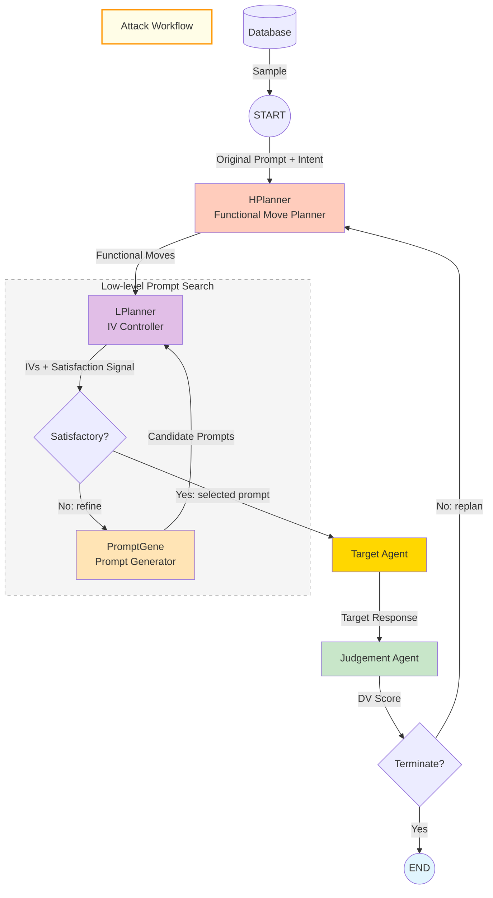

<div align="center">

# All For Jailbreak

**A Comprehensive Framework for AI Jailbreak Attack Research and Evaluation**

[](https://opensource.org/licenses/MIT)
[](https://www.python.org/downloads/)
[](https://github.com/langchain-ai/langgraph)

</div>

---

## Overview

**All For Jailbreak** is a research framework designed for testing and evaluating AI model security against jailbreak attacks. It implements a sophisticated multi-turn attack workflow that attempts to bypass AI safety measures through iterative refinement and strategic planning.

### Key Features

- **Multi-level Planning Architecture** - High-level and low-level planners for strategic attack generation
- **Iterative Refinement Loop** - Continuous prompt optimization based on feedback signals
- **Comprehensive Evaluation** - Automated success/failure assessment

## Architecture

The framework implements a hierarchical attack workflow with the following components:



### Workflow Components

| Component | Description |
|-----------|-------------|
| **High-Level Planner** | Generates functional moves (attack strategies) |
| **Low-Level Planner** | Controls independent variables (IVs) and satisfaction signals |
| **Prompt Generator** | Creates refined attack prompts |
| **Target Agent** | The target model being tested for vulnerabilities |
| **Judge Agent** | Evaluates attack success and provides dependent values (DVs) |

## Installation

### Prerequisites

- Python 3.9 or higher
- pip package manager
- Git

### Clone the Repository

```bash
git clone https://github.com/HaoranWang-TJ/all4jailbreak.git
cd all4jailbreak
# Initialize and update submodules
git submodule init
git submodule update
```

### Install Dependencies

```bash
pip install -r requirements.txt
```

## Configuration

Copy the example configuration file and customize it with your API credentials:

```bash
cp config.env.example config.env
# Edit config.env with your API keys and endpoints
```

### Configuration Structure

The framework supports three categories of API configuration:

| Category | Description | Fallback |
|----------|-------------|----------|
| **TARGET** | Target model being attacked | Required (no fallback) |
| **ATTACK** | Attack agent model (planner & generator) | → TARGET if not set |
| **EVALUATION** | Evaluation/judge model | → TARGET if not set |

#### Example Configuration

```env
# ===== TARGET Configuration (Required) =====
TARGET_OPENAI_API_KEY=your-target-api-key-here
TARGET_BASE_URL=https://api.openai.com/v1
TARGET_MODEL_NAME=gpt-4

# ===== ATTACK Configuration (Optional) =====
# Falls back to TARGET_* if not set
ATTACK_OPENAI_API_KEY=your-attack-api-key-here
ATTACK_BASE_URL=https://api.openai.com/v1
ATTACK_MODEL_NAME=gpt-4

# ===== EVALUATION Configuration (Optional) =====
# Falls back to TARGET_* if not set
EVALUATION_OPENAI_API_KEY=your-eval-api-key-here
EVALUATION_BASE_URL=https://api.openai.com/v1
EVALUATION_MODEL_NAME=gpt-4

# ===== Dataset Configuration =====
DATASET_NAME=harmbench_test
```

> **Note**: Never commit your `config.env` file to version control. It is already included in `.gitignore`.

## Usage

### Batch Testing

The framework supports batch testing for large-scale evaluation against harmful prompt datasets.

#### Running Batch Tests

Execute batch testing on the harmful dataset:

```bash
python main_batch_test.py
```

#### Configuration

Configure batch test parameters in `main_batch_test.py`:

```python
# Number of samples to test (None for all samples)
MAX_SAMPLES = 10

# Starting index in the dataset
START_INDEX = 0
```

#### Output Structure

```
batch_results_20260121_123456/
├── attack_summary_prompt_0_20260121_123456.html
├── attack_summary_prompt_0_20260121_123456.json
├── attack_summary_prompt_1_20260121_123457.html
├── attack_summary_prompt_1_20260121_123457.json
├── ...
├── batch_summary_20260121_125000.json
└── dashboard_20260121_125001.html
```

## Contributors

- **[Haoran Wang (王浩然)](https://github.com/HaoranWang-TJ)** - Core architecture & implementation
- **[Siyu Chen (陈思宇)](https://github.com/charlottec1583)** - Workflow optimization & testing

## License

This project is licensed under the MIT License - see the [LICENSE](LICENSE) file for details.

---

<div align="center">

**[⬆ Back to Top](#all-for-jailbreak)**

Made with ❤️ for `All for Jailbreak`

</div>
